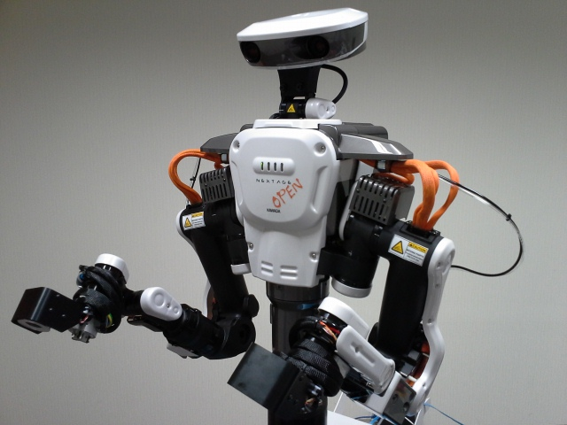

# Nextage Description (MJCF)

## Overview

This package contains a simplified robot description (MJCF) of the [Nextage Open](https://rtmros-nextage.readthedocs.io/) developed by [Kawada Robotics](https://nextage.kawadarobot.co.jp/open).
It is derived from the [publicly available URDF description](https://github.com/tork-a/rtmros_nextage/tree/indigo-devel/nextage_description).

  

## License

This model is released under an [Apache-2.0 License](LICENSE), while the original URDF model is released under an [BSD License](https://opensource.org/license/bsd-3-clause).
